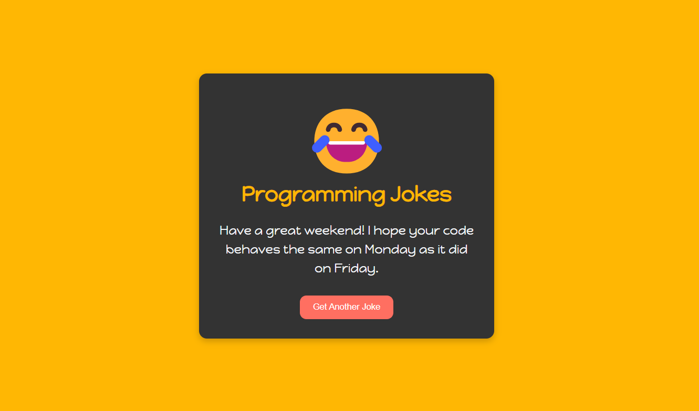

# 🎉 Jokes Website 😂

Welcome to the **Jokes Website** — a fun project to lighten up your day with random programming jokes! Get ready to chuckle with every click of the "Next Joke" button! 😄

## 🌟 Features

- 🎲 Fetches and displays random programming jokes
- 🖌️ Simple and clean user interface with smooth transitions and spinner

## 🌐 Live Demo

Check out the live version here: [Jokes Website Live](YOUR_LIVE_VERSION_LINK_HERE)

## 🛠️ Tech Stack

- **HTML** for structure
- **CSS** for styling
- **JavaScript** for interactivity and API calls

## 📸 Screenshot

## 📡 API

The jokes are fetched from the [Joke API](https://v2.jokeapi.dev/joke/Programming?type=single) using the `fetch` method.
